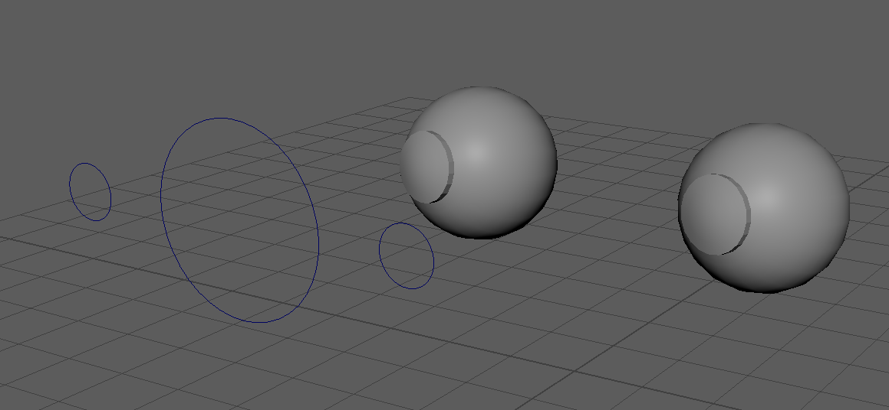
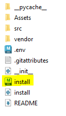
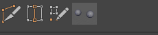
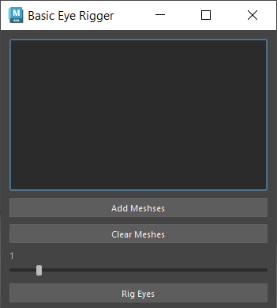
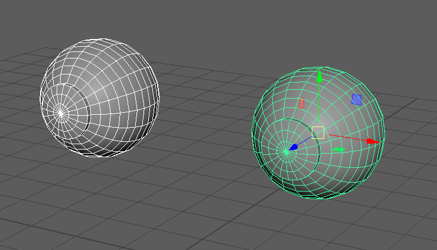
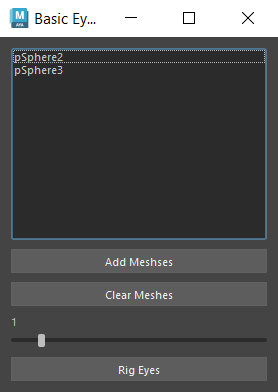
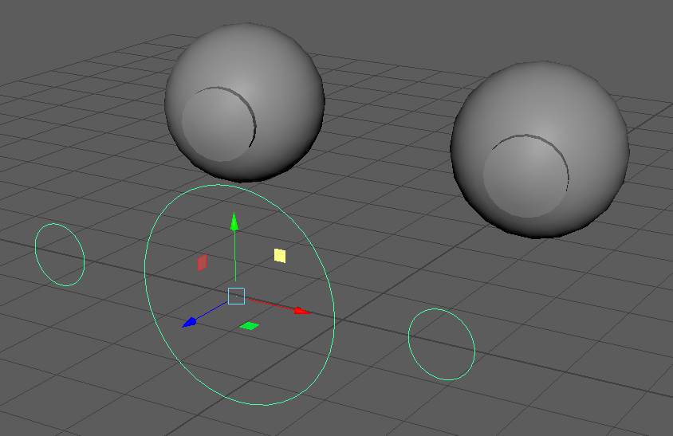

# Eye Rigger Tool

## This plugin takes two meshes and makes a basic eye rig set up

* Creates One Main Controller
* Two smaller controllers for each eye are parented to the main one
* Eye meshes are constrained to look at their respective controllers
* Groups eye meshes into a new grp

## How to Install

* Take the install.mel file and drag it into the Maya viewport
* Then it should show up on the Maya tool shelf

## How to Use

* First, click the tool shelf icon to open the tool

* Then, select the meshes you want to use in the rig

* Then clicked the "Add Meshes" button
* (You can press the "Clear Meshes" Button if you would like to clear your selection)
* Then set the desired controller size using the slider

* And then finally click the "Rig Eyes" button and let it do it's thing!